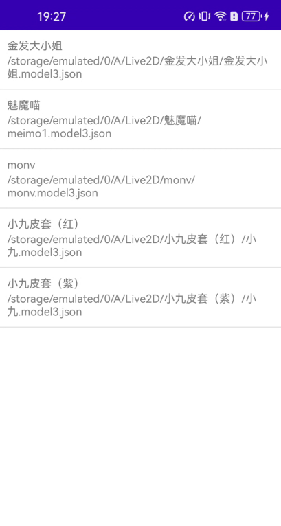

# ALive2D

Simple Live2D Native Library for Android

Arch configuration:

`build.gradle.kts(Module:app)`

```kotlin
ndk {
    abiFilters.add("arm64-v8a")
//    abiFilters.add("x86")
//    abiFilters.add("x86_64")
}
```

Live2D 模型文件存放于：
```kotlin
val dir = File(Environment.getExternalStorageDirectory(), "A/Live2D")
```

## Preview



